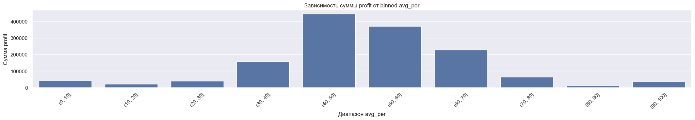
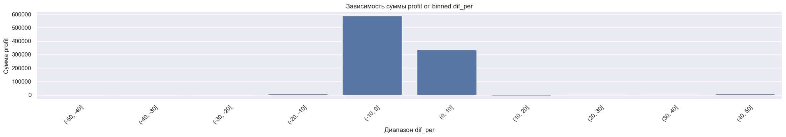

# pj4_volatile_day_volumes

Определение волатильного дня по объемам  

Проверка предположения, что когда на рынок приходят умные деньги, имеющие идею о движении рынка, на рынке появляется увеличенный объем торгов. Также по предположению, в такие дни должны быть долгие(в течении торговой сесии) направленные движения во время которых будут хорошо работать все трендовые стратегии.

Вначале, для минутного графика котировок, расчитываются накопленные объемы каждого бара с начала дня.  

Далее вычисляется перцентиль этих объемов к таким же накопленным объемам за 30 предыдущих торговых дней. Превышение 50 перцентиля говорит о повышенных вливаниях объемов в рынок.

Для симуляции сделок используется трендовая стратегия Genesis Matrix. Вернее используются только 4 индикатора из этой стратегии, которые образуют матрицу.

**ВЫВОД**  
Предположение оказалаось несостоятельным. Повышение объемов не дает преимущество для трендовой стратегии торговли.
Симуляция торговли по системе GMTS, показала что большую прибыль дают сигнала когда перцентиль объемов имеет значения 40-50. А согласно предположению эти значения должны бвли быть больше 50.

Также большую суммарную прибыль дает симуляция торговли при которой открытие сделки происходит при понижении объемов относительно 30 предыдущих торговых сессий.

